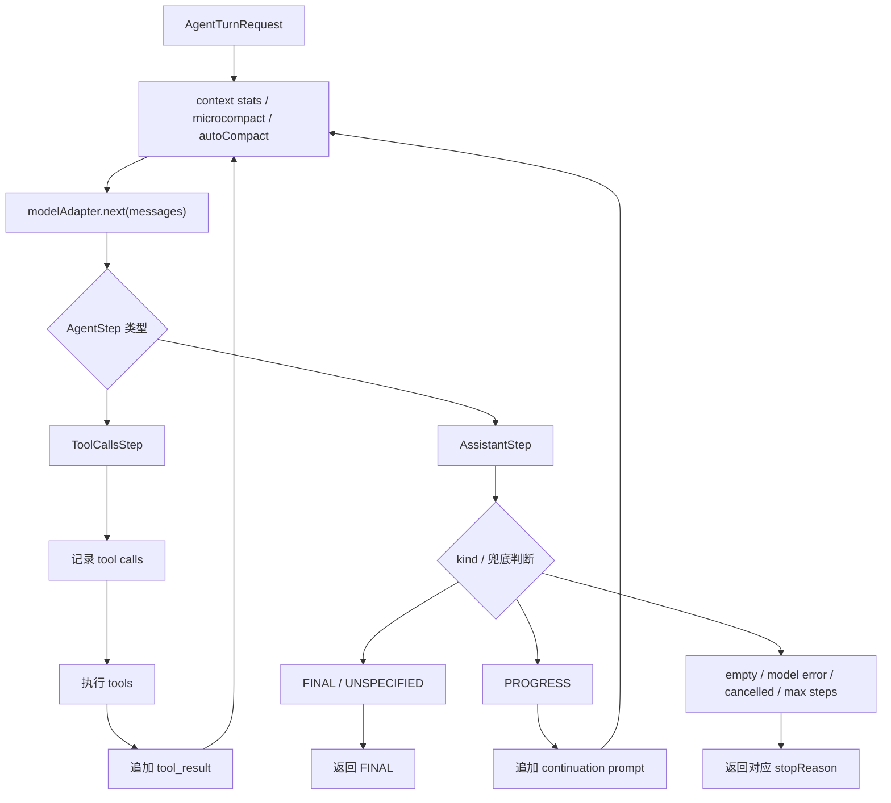
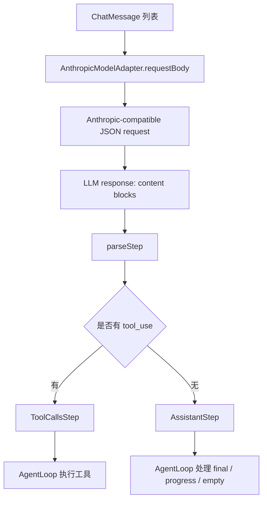
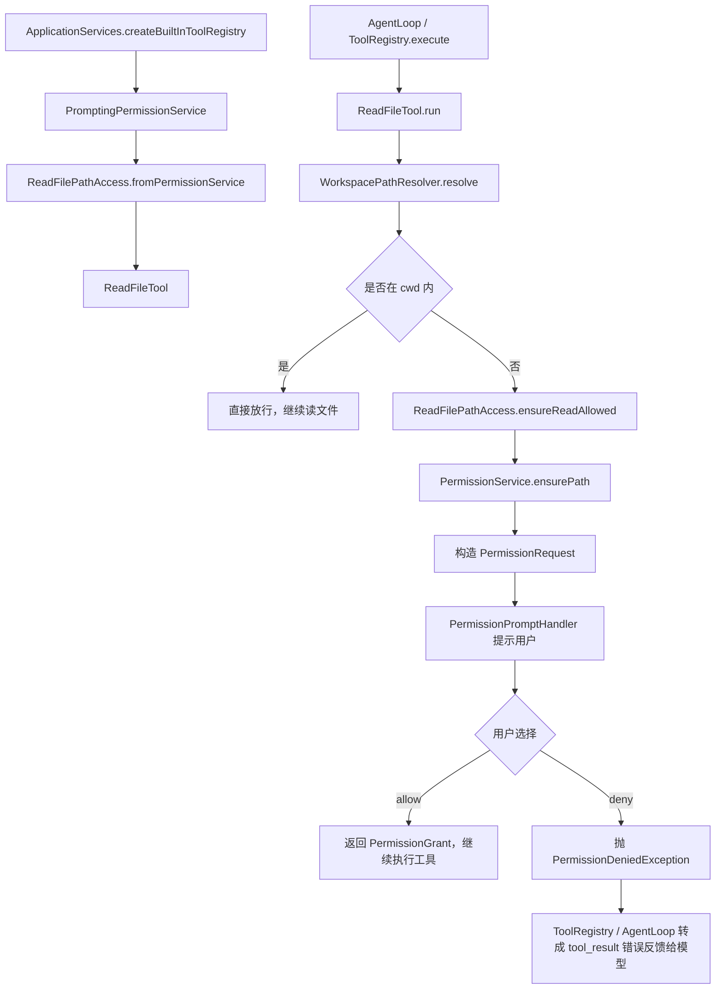

# MiniCode4j学习手册

此文档是minicode4j的阅读指引，帮助读者理解这个coding agent的几个核心模块 。

## *AgentLoop：coding agent 如何从一次用户输入推进到最终回答*

### 大致看一下整个链路

首先从程序启动捋一下整个链路。

TS前端的启动入口在frontend/ts-cli/src/main.ts，它会解析cli参数，拼接出Java命令（java -jar ...）启动Java后端，并读取用户的输入。两者的交互协议在frontend/ts-cli/src/protocol.ts。

Java app入口在src/main/java/minicode/app/MiniCodeApp.java。

```java
public static void main(String[] args) {
        int exitCode = run(
                ...
        );
        if (exitCode != 0) {
            System.exit(exitCode);
        }
    }
```

首先解析并处理参数

```java
 try {
            appArgs = AppArgs.parse(args);
            actualCwd = resolveActualCwd(cwd, appArgs);
        } catch (RuntimeException exception) {
            err.println("Runtime error: " + safeMessage(exception, env));
            return 1;
        }

//下面多个if处理参数
```

其中,这个分支启动了UiStdioRealBackend（如果没有用--tty启动minicode，launcher 就不会跳过 TS frontend，TS frontend会用--ui-stdio-run启动后端，从而进入这个分支）

```java
 if (appArgs.uiStdioRun()) {
            RuntimeConfig runtimeConfig;
            try {
                runtimeConfig = RuntimeConfigLoader.load(new RuntimeConfigLoader.Input(home, actualCwd, env));
            } catch (RuntimeConfigException exception) {
               ...
                return 2;
            }
            UiStdioRealBackend.real(runtimeConfig).run(home, actualCwd, input, output,effectiveMaxSteps(java.util.Optional.ofNullable(appArgs.maxStepsOverride()), java.util.Optional.of(runtimeConfig)));
            return 0;
        }
```

于是，通过UiStdioRealBackend的run启动了程序。在这个方法里，会循环读取TS前端发来的command（Loop外层的工作大循环，也就是前后端交互的大循环），根据command类型改变后端的状态，不断启动agent turn，然后处理之后将结果交给TS前端，完成一次交互。具体如下：

```java
while ((line = reader.readLine()) != null) {
             
                JsonNode command = MAPPER.readTree(line);
                String type = command.path("type").asText("");
                switch (type) {
                    case "init" -> {
                       ...
                    }
                    case "user_submit" -> {
                        ...
                    }
                    case "permission_response" -> ...
                    case "ask_user_answer" -> {
                        ...
                    }
                    default -> emitter.emit(new UiEvent.Error("Unsupported UI command: " + type, true));
                }
                if (activeTurn != null && activeTurn.isDone()) {
                    waitForTurn(activeTurn, permissionHandler);
                    running = false;
                }
            }
```

在**user_submit 分支**里，会启动runUserTurn(...)，这里开启agentLoop

`user_submit` 分支本身只是把 `runUserTurn(...)` 丢进异步执行；真正组装本轮历史、持久化用户输入并进入 AgentLoop，都在 `runUserTurn(...)` 里发生。

```java
activeTurn = CompletableFuture.runAsync(() ->runUserTurn(text, 		

                                                         	actualServices, actualSession, emitter), turnExecutor);
```

最后调用到AgentLoop的runTurn方法，实际执行一个agentTurn。

**一个agentTurn可以理解成输入一次prompt，agent在loop里工作直到遇到问题或完成任务停下的过程。**

AgentLoop是minicode的心脏。读懂了loop，就能搞明白整个项目的工作链路。

```java
public final class AgentLoop {
    
    //前面这些是在特定情况下会返回给大模型的prompt，比如EMPTY_RESPONSE_MESSAGE是程序在模型输出空输出时返回给模型，让模型重新生成的。
    private static final String EMPTY_RESPONSE_MESSAGE ="...";
    private static final String PROGRESS_CONTINUATION_PROMPT ="...";
    private static final String EMPTY_RESPONSE_CONTINUATION_PROMPT ="...";
    private static final String EMPTY_RESPONSE_AFTER_TOOL_RESULT_CONTINUATION_PROMPT ="...";
    private static final String EMPTY_RESPONSE_AFTER_TOOL_ERROR_CONTINUATION_PROMPT ="...";
    private static final String MAX_TOKENS_THINKING_CONTINUATION_PROMPT ="...";
    private static final String PAUSE_TURN_THINKING_CONTINUATION_PROMPT ="...";
    private static final int MODEL_REQUEST_ATTEMPTS = 3;//重试次数
//  很多个构造函数，但是除了测试之外，最后都会走这一个

    public AgentLoop(ModelAdapter modelAdapter, AgentEventSink eventSink, ToolExecutor toolExecutor,
                     ContextManager contextManager, ContextStatsCalculator contextStatsCalculator,
                     AutoCompactController autoCompactController,
                     int maxEmptyResponseRetries) {...}

```

AgentLoopの出场人物：

```java
    //统一的模型接口，负责把当前 messages 发给 provider，并返回 AssistantStep 或 ToolCallsStep
	private final ModelAdapter modelAdapter;

	//事件出口，负责把 AgentLoop 过程事件发给 TUI/UI，比如工具开始、工具结束、context stats、await user
    private final AgentEventSink eventSink;

	//工具执行入口，负责根据模型请求的 tool call 执行具体工具
    private final ToolExecutor toolExecutor;

	//上下文管理器，负责 microcompact、大工具输出 replacement、tool result batch budget等上下文管理动作。
    private final ContextManager contextManager;

	//上下文统计器，负责计算当前 messages 的 token 使用量、窗口占用率和 warning level
    private final ContextStatsCalculator contextStatsCalculator;

	//自动压缩控制器，负责在模型请求前判断是否需要 autoCompact，并调用模型执行压缩
    private final AutoCompactController autoCompactController;

	//空响应重试次数，模型连续返回空内容时，AgentLoop 最多追加几次续跑提示
    private final int maxEmptyResponseRetries;
```

接下来看看runTurn的一些链路细节：

整体结构很清晰,AgentTurnRequest进入到循环里面倒腾，然后吐一个AgentTurnResult出去。

```java
public AgentTurnResult runTurn(AgentTurnRequest request) {
        try {
 			for (int stepIndex = 0; stepIndex < request.maxSteps(); stepIndex++)
    		{
        	//所谓Loop
        
    		} 
            return AgentTurnResult.maxSteps(List.copyOf(messages), new TurnPersistencePlan(actions));
        } catch (CancellationRequestedException exception) {...}
    
    }
```

### Loop里面的一些细节

一个AgentTurnRequest大致会包含这些信息。

```java
public record AgentTurnRequest(
        String turnId,
        Path cwd,//这是工作目录
        String sessionId,//session,也就是一个会话的唯一标识
        List<ChatMessage> messages,//历史，是上一次压缩之后，llm可见的上下文
        int maxSteps,//一个turn的最大步数
        Optional<String> modelName,//模型名称
        CancellationToken cancellationToken//本轮 turn 的取消信号,在整个项目到处可以看到在各种检查点检查是不是有这个信号，然后抛异常退出。但是目前退出并不依赖这个设计，所以看到这个东西可以无视它。
) {
   ...
    }
    public AgentTurnRequest {
      ...
    }
}
```

AgentLoop的每一次循环是一个Step，每一个Step开始，都会先计算一次上下文数据，并进行一次microcompact，并视情况而定进行AutoCompact

```java
for (int stepIndex = 0; stepIndex < request.maxSteps(); stepIndex++) {
    //计算上下文用量
                ContextStats preCompactStats = contextStatsCalculator.calculate(List.copyOf(messages));
    //microCompact
                messages = new ArrayList<>(contextManager.microcompact(List.copyOf(messages), preCompactStats));
    //再统计
                ContextStats stats = contextStatsCalculator.calculate(List.copyOf(messages));
    //判断要不要AutoCompact，要的话就压缩
                AutoCompactResult autoCompactResult = runAutoCompactPreflight(request.turnId(), messages, actions, stats);
    //如果真的压缩了，就更新messages局部变量和stats统计数据
                if (autoCompactResult.status() == CompactStatus.COMPACTED) {
                    messages = new ArrayList<>(autoCompactResult.messages());
                    stats = contextStatsCalculator.calculate(List.copyOf(messages));
                }
    //发布给前端
    publishEvent(new AgentEvent.ContextStatsEvent(request.turnId(), Instant.now(), stats));
    //...
```

确保了上下文不会爆炸之后，就要来真的调用llm干活了！调用大模型，返回一个AgentStep。

```java
AgentStep step;
try {
	step = nextWithRetries(List.copyOf(messages), request.cancellationToken());
    //...
                 }

```

AgentStep是一个接口：

```java
public sealed interface AgentStep permits AssistantStep, ToolCallsStep {
}

```

说明Loop一共可以收到provider处理好的两类信息，一类是说话，一类是工具调用。

```java
public record AssistantStep(String content, AssistantKind kind, List<ProviderThinkingBlock> thinkingBlocks,
                            Optional<StepDiagnostics> diagnostics, Optional<ProviderUsage> usage) implements AgentStep {
    public AssistantStep {
        //说话的内容
        content = Objects.requireNonNull(content, "content");
        //这段内容的语义类型，决定 AgentLoop 怎么处理
        kind = Objects.requireNonNull(kind, "kind");
        //模型的推理
        thinkingBlocks = List.copyOf(Objects.requireNonNull(thinkingBlocks, "thinkingBlocks"));
        //provider stop reason、block types 等诊断信息，用于恢复或报错
        diagnostics = Objects.requireNonNull(diagnostics, "diagnostics");
        //provider 返回的 token usage，用于 context accounting
        usage = Objects.requireNonNull(usage, "usage");
    }

    public AssistantStep(String content, AssistantKind kind) {
        this(content, kind, List.of(), Optional.empty(), Optional.empty());
    }
}
```

```java
public record ToolCallsStep(List<ToolCall> calls, Optional<String> content, ContentKind contentKind,
                            List<ProviderThinkingBlock> thinkingBlocks, Optional<StepDiagnostics> diagnostics,
                            Optional<ProviderUsage> usage) implements AgentStep {
    public ToolCallsStep {
        //对工具的调用,至少一个
        calls = List.copyOf(Objects.requireNonNull(calls, "calls"));
        if (calls.isEmpty()) {
            throw new IllegalArgumentException("tool calls step requires at least one call");
        }
        //模型在调用工具同时附带的文字，比如进度说明
        content = Objects.requireNonNull(content, "content");
        //content 的语义，是 PROGRESS 还是普通内容，但是目前来看模型在连续调用工具的时候不太喜欢说话
        contentKind = Objects.requireNonNull(contentKind, "contentKind");
        //provider 返回的 thinking block
        thinkingBlocks = List.copyOf(Objects.requireNonNull(thinkingBlocks, "thinkingBlocks"));
        //同上
        diagnostics = Objects.requireNonNull(diagnostics, "diagnostics");
        usage = Objects.requireNonNull(usage, "usage");
    }
}

//call:
public record ToolCall(String id, String toolName, JsonNode input) {
    public ToolCall {
        //一次工具调用的id标识
        requireText(id, "id");
        //工具名
        requireText(toolName, "toolName");
        //工具需要的参数
        input = Objects.requireNonNull(input, "input");
    }

	//...
}


```

接下来，在Loop里，分门别类处理step信息：

工具调用：这里面有两个for，第一个这一批 tool calls 全部写进 messages/actions，并通知 UI 工具开始，第二个真正地逐个执行工具，并追加tool_result。

```java
if (step instanceof ToolCallsStep toolCallsStep)
{
     for (int callIndex = 0; callIndex < toolCallsStep.calls().size(); callIndex++){... }
     for (ToolCall call : toolCallsStep.calls()) {...}
}
```

除了工具调用，在进入assistantStep的处理时会有两层兜底

```java
//一种情况是 provider 返回了 thinking block，但没有给正常文本或工具调用
if (isRecoverableThinkingStop(assistantStep) && recoverableThinkingRetryCount < 3)
{
}
//content 为空
//并且 diagnostics stopReason 是 max_tokens / pause_turn
//并且存在 thinking 迹象
//并且重试次数 < 3
```

这时就在messages里追加一条消息，然后依据情况拼接一句prompt，让模型重新输出。

```java
appendMessage(request.turnId(), messages, actions, new UserMessage(
	"max_tokens".equals(stopReason)
    	? MAX_TOKENS_THINKING_CONTINUATION_PROMPT
     	: PAUSE_TURN_THINKING_CONTINUATION_PROMPT
));
```

第二层是，模型没有给出可见 content，并且没有命中上面的“可恢复 thinking stop”条件。

```java
if (assistantStep.content().isBlank()) 
{
}
```

就按照空响应重试，如果重试次数到上限了返回 EMPTY_RESPONSE_FALLBACK（直接return离开Loop）。


接下来就按照kind字段来分类处理assistant类型的step

```java
switch (assistantStep.kind()) {
	case FINAL, UNSPECIFIED -> {
        //...
	}
	case PROGRESS -> {
        //...
	}
}
```

三种kind分别代表：

```java
public enum AssistantKind {
    FINAL,//模型认为一次任务结束，主动结束任务。
    PROGRESS,//只是中间的输出，AgentLoop 不会把它当 final，而是追加 continuation prompt 继续下一 step。
    UNSPECIFIED//没能明确判断这段 assistant 内容是 FINAL 还是 PROGRESS，但它是一段正常 assistant 文本，这是兜底
}
```

处理的动作是很相似的，都是走`appendMessage`

```java
    private void appendMessage(String turnId, List<ChatMessage> messages, List<PersistenceAction> actions,
                               ChatMessage message) {
        messages.add(message);
        actions.add(new PersistenceAction.AppendMessagesAction(List.of(message)));
        publishEvent(new AgentEvent.AssistantMessageEvent(turnId, Instant.now(), message));
    }
```

在这个方法里追加历史信息（如果本轮不退出循环，在下次循环通过上下文压缩之后会再次返回给大模型），追加action（这和持久化有关，后面再单独说），publishEvent和可视化有关。

然后，如果还没有达到maxStep，便会继续循环。




## Agent程序与 LLM 的对接：Provider、Adapter 与 AgentStep


### 为什么需要 Adapter

在上文我们提到Loop有一个人ModelAdapter。它专门负责把当前 messages 发给 provider，并返回 AssistantStep 或 ToolCallsStep。Loop属于整个项目的核心模块（core包），这里的设计是，core 不认识 Anthropic/OpenAI 协议，只认识 ModelAdapter 和 AgentStep。**考虑到一些模型能力实在低下，要一开始便让模型稳定返回结构非常漂亮的数据**（比如json schema强制其返回Step）**是很难的事情**，所以这里只让模型返回**结构较为松散的数据**（后面会讲），然后让adapter处理成两大类Step，也就是我们在Loop里看到的，循环真正在消费的东西。

```java
//统一的模型接口，负责把当前 messages 发给 provider，并返回 AssistantStep 或 ToolCallsStep
private final ModelAdapter modelAdapter;
```

### 来看一下Adapter

```java
@FunctionalInterface
public interface ModelAdapter {
    AgentStep next(List<ChatMessage> messages);
}

```

`ModelAdapter`只有一个职责，接收消息历史，就是返回`Loop`里消费的`Step`。可以理解为**LLM 协议和 MiniCode core 语义之间的翻译层：向外说 Anthropic-compatible protocol，向内只交付 provider-neutral 的AgentStep**

目前项目里主要的实现是AnthropicModelAdapter，也就是面向Anthropic协议的翻译官。


```java
    @Override
    public AgentStep next(List<ChatMessage> messages) {
        //把messages变成请求体
        JsonNode requestBody = requestBody(messages);
        //丢给llm，获得回复
        AnthropicTransport.Response response = sendWithRetries(requestBody);
        //解析响应体
        JsonNode data = parseBody(response.body());
        if (!response.ok()) {
            throw new ProviderRequestException(extractErrorMessage(data, response.statusCode()),
                    Optional.of(response.statusCode()), shouldRetryStatus(response.statusCode()));
        }
        //翻译成Step返回。
        return parseStep(data);
    }
```

我们来仔细看看这些JsonNode长什么样：

先看请求体：

```java
    private JsonNode requestBody(List<ChatMessage> messages) {
        ObjectNode root = MAPPER.createObjectNode();
        root.put("model", runtimeConfig.model());//模型名
        root.put("system", systemText(messages));//一字千金的系统提示词
        root.set("messages", toProviderMessages(messages));//上下文消息历史
        root.set("tools", toolSchemas());//这是工具的Schema，教llm正确使用工具的，后面用一个小节仔细讲
        root.put("max_tokens", resolvedMaxOutputTokens.orElseGet(() ->
                ModelLimits.resolveMaxOutputTokens(runtimeConfig.model(), runtimeConfig.maxOutputTokens())));//这是模型一次允许返回的最多token
        return root;
    }
```

mock一下：

```json
{
  "model": "mimo-v2.5-pro",
  "system": "你是 MiniCode...工具说明...",
  "messages": [
    {
      "role": "user",
      "content": [
        {
          "type": "text",
          "text": "请读取 README"
        }
      ]
    }
  ],
  "tools": [
    {
      "name": "read_file",
      "description": "Read a file from the workspace...",
      "input_schema": {
        "type": "object",
        "properties": {
          "path": {
            "type": "string"
          }
        },
        "required": ["path"]
      }
    }
  ],
  "max_tokens": 16000
}
```

message有好几类，这里一起讲清楚：

UserMessage：

```java
new UserMessage("请读取 README")
```

会变成：

```json
{
  "role": "user",
  "content": [
    {
      "type": "text",
      "text": "请读取 README"
    }
  ]
}
```

AssistantMessage：

```java
new AssistantMessage("好的")
```

会变成：

```json
{
  "role": "assistant",
  "content": [
    {
      "type": "text",
      "text": "好的"
    }
  ]
}
```

AssistantProgressMessage：

```java
new AssistantProgressMessage("我先查看 README")
```

会变成：

```json
{
  "role": "assistant",
  "content": [
    {
      "type": "text",
      "text": "<progress>\n我先查看 README\n</progress>"
    }
  ]
}
```

AssistantToolCallMessage：

```java
toolUseId = "tool-1" toolName = "read_file" input = {"path":"README.md"}
```

会变成：

```json
{
  "role": "assistant",
  "content": [
    {
      "type": "tool_use",
      "id": "tool-1",
      "name": "read_file",
      "input": {
        "path": "README.md"
      }
    }
  ]
}
```

ToolResultMessage：

```java
toolUseId = "tool-1" content = "文件内容..." error = false
```

会变成：

```json
{
  "role": "user",
  "content": [
    {
      "type": "tool_result",
      "tool_use_id": "tool-1",
      "content": "文件内容...",
      "is_error": false
    }
  ]
}
```


### LLM 返回的 block

 Anthropic Messages API 的响应对象大概长这个样子：

```json
{
  "id": "msg_abc123",
  "type": "message",
  "role": "assistant",
  "model": "mimo-v2.5-pro",
  "stop_reason": "tool_use",
  "stop_sequence": null,
  "content": [
    {
      "type": "text",
      "text": "<progress>我先读取 README。</progress>"
    },
    {
      "type": "tool_use",
      "id": "toolu_01ABC",
      "name": "read_file",
      "input": {
        "path": "README.md"
      }
    }
  ],
  "usage": {
    "input_tokens": 1200,
    "cache_creation_input_tokens": 0,
    "cache_read_input_tokens": 0,
    "output_tokens": 80
  }
}
```


这里的核心字段就是content。content是一个block数组。里面的一块一块的东西是模型返回的最小单元。

**LLM 返回 tool_use **

```json
{
  "stop_reason": "tool_use",
  "content": [
    {
      "type": "text",
      "text": "<progress>我先读取 README。</progress>"
    },
    {
      "type": "tool_use",
      "id": "tool-1",
      "name": "read_file",
      "input": {
        "path": "README.md"
      }
    }
  ],
  "usage": {
    "input_tokens": 1000,
    "output_tokens": 80
  }
}
```


**LLM 返回 final 文本**

```json
{
  "stop_reason": "end_turn",
  "content": [
    {
      "type": "text",
      "text": "<final>README 里说明这是 MiniCode4j 项目。</final>"
    }
  ],
  "usage": {
    "input_tokens": 1200,
    "output_tokens": 60
  }
}
```


**LLM 返回 thinking 时长这样**

大概形态：

```json
{
  "stop_reason": "max_tokens",
  "content": [
    {
      "type": "thinking",
      "thinking": "..."
    }
  ],
  "usage": {
    "input_tokens": 1000,
    "output_tokens": 16000
  }
}
```


**不过，在程序中，并不是一个block对应一个step，实际上，LLM返回了一个block数组，程序会对这个数组进行一次处理，归并成一个Step。**具体是怎么做的呢？这里处理太妙了，我必须放一整段代码狠狠品鉴：

```java
    private AgentStep parseStep(JsonNode data) {
        //首先吧content拿出来，然后准备几个数组分类
        JsonNode content = data.get("content");
        List<ToolCall> toolCalls = new ArrayList<>();//这个放工具调用的block
        List<String> textParts = new ArrayList<>();//这个放文本block
        List<ProviderThinkingBlock> thinkingBlocks = new ArrayList<>();//这个放思考block
        List<String> blockTypes = new ArrayList<>();//这个放模型返回的type
        LinkedHashSet<String> ignoredBlockTypes = new LinkedHashSet<>();//这个放程序无法识别的block type，这里会放到诊断信息里面，如果后面解析完了发现，程序认识的正经的type一个都没有，就可以把错误的拿出来说事

        if (content != null && content.isArray()) {
            for (JsonNode block : content) {//循环取出block
            String type = block.path("type").asText("");
            blockTypes.add(type);
            switch (type) {//分门别类放进刚才准备好的数组里
                case "text" -> textParts.add(block.path("text").asText(""));
                case "tool_use" -> toolCalls.add(new ToolCall(
                        block.path("id").asText(),
                        block.path("name").asText(),
                        block.path("input").isMissingNode() ? MAPPER.createObjectNode() : block.path("input")
                ));
                case "thinking", "redacted_thinking" -> thinkingBlocks.add(new ProviderThinkingBlock(type, block));
                default -> ignoredBlockTypes.add(type);
            }
            }
        }
		//所有text文本拼在一起。这里模型会按system prompt要求返回<>标签包裹的文本，程序依照这个标签来处理text，标记不同的AssistantKind
        ParsedText parsedText = parseAssistantText(String.join("\n", textParts).trim());
        
        StepDiagnostics diagnostics = new StepDiagnostics(
                optionalText(data.path("stop_reason").asText("")),
                blockTypes,
                List.copyOf(ignoredBlockTypes)
        );//诊断信息，后面发现出问题了就会在这里找线索，后面两种Step里面都会携带。
        Optional<ProviderUsage> usage = normalizeUsage(data.get("usage"));
        //如果有工具调用，那么返回出去的的Step就是ToolCallsStep
        if (!toolCalls.isEmpty()) {
            return new ToolCallsStep(
                    toolCalls,
                    optionalText(parsedText.content()),
                    parsedText.kind() == AssistantKind.PROGRESS ? ContentKind.PROGRESS : ContentKind.UNSPECIFIED,
                    thinkingBlocks,
                    Optional.of(diagnostics),
                    usage
            );
        }
        //如果没有，那么返回AssistantStep
        return new AssistantStep(parsedText.content(), parsedText.kind(), thinkingBlocks, Optional.of(diagnostics), usage);
    }

```

这样的block归并处理降低了LLM返回结构准确性的难度。Anthropic 协议约束 message/content/tool_use/tool_result 的结构；Tool schema 约束 tool_use.input 的形状；SystemPromptBuilder 约束 text block 里的 <progress>/<final> 语义。也就是说，模型只是在协议允许的结构里“选择工具 + 填参数”，结构由 provider/tool schema 承担一部分约束。


**为了让模型产出的东西可解析、可使用（能被上面这个方法解析、在后面工具调用等地方程序能正常工作），一共对它有两类约束**

**一、外部协议约束：Anthropic-compatible Messages API**

这是 provider 层保证的结构，不主要靠 prompt。它约束 **HTTP 请求/响应的 JSON 形状**

> **Anthropic Messages API 规定：成功的 /v1/messages 响应是一个 Message JSON object，其中 content 是必填的 content block 数组；每个 block 通过 type 决定具体形状。简单地说，这个协议的作用是，约束模型的每一次返回到一个固定结构。**

```json
{
  "id": "...",
  "type": "message",
  "role": "assistant",
  "content": [ ...blocks... ],
  "model": "...",
  "stop_reason": "...",
  "usage": { ... }
}
```

**但是！*协议只能约束 JSON 结构，不能保证 text block 里的自然语言一定符合 MiniCode 的语义***

所以，需要在**系统提示词**里面告诉它，在这个骨架里面具体需要填些什么。SystemPromptBuilder 里真正约束 text block 语义的核心是这一段：

```
Structured response protocol:
- Use <progress> for brief, concrete status updates during multi-step work, especially before or between tool batches, searches, edits, long commands, and verification.
- Use <progress> only when you are still working and will continue with more tool calls or reasoning.
- Keep <progress> concise; report what you are doing or what you found.
- Use <final> only when the task is actually complete and control should return to the user.
- After <progress>, continue immediately in the next step. Do not stop at a progress note.
- Plain assistant text may be treated as a completed assistant message.
```

它告诉llm，<progress> 表示“我还没完成”，如果只是中间状态，不要直接普通文本输出，要包在 <progress> 里，且<progress> 只能用于继续工作。<final> 表示“任务完成”。




## 如何增加一个新内置工具：工具系统

先来看看一个工具是什么样的。

具体的工具类应当实现工具接口。

```java
public interface Tool {
    ToolMetadata metadata();

    JsonNode inputSchema();

    ValidationResult validateInput(JsonNode input);//校验模型给的工具input

    ToolResult run(JsonNode normalizedInput, ToolContext toolContext);//工具执行
}
```

ToolMetadata是工具的元信息的汇总。

```java
public record ToolMetadata(String name, String description, JsonNode inputSchema, ToolOrigin origin,
                           Set<ToolCapability> capabilities, ToolStatus status) {
    public ToolMetadata {
        requireText(name, "name");//名称
        description = Objects.requireNonNull(description, "description");//描述
        inputSchema = Objects.requireNonNull(inputSchema, "inputSchema");//格式
        origin = Objects.requireNonNull(origin, "origin");//工具来源，包括内置、mcp、未来扩展工具
        capabilities = Set.copyOf(Objects.requireNonNull(capabilities, "capabilities"));//工具工具能力类型
        status = Objects.requireNonNull(status, "status");//当前工具状态：可用/禁用/加载
    }
	//...
}
```

然后，我们来看看工具的注册、校验和实际执行。所有的工具的注册、校验和实际执行都必须经过ToolRegistry。

这个类实现了ToolExecutor接口，是Loop里执行工具的Executor的实际的实现类

```java
public final class ToolRegistry implements ToolExecutor {
    //工具实际的存放是一个LinkedHashMap
	private final Map<String, Tool> toolsByName = new LinkedHashMap<>();
    //注册工具
    public void register(Tool tool){...}
    //根据工具名查找工具
    public Optional<Tool> find(String name){...}
    //先进行校验，然后调用具体工具类重写过的run方法执行工具
    @Override
    public ToolResult execute(ToolCall call, ToolContext toolContext){...}
	
}
```

细节如下：

```java
    @Override
    public ToolResult execute(ToolCall call, ToolContext toolContext) {
        ToolCall actualCall = Objects.requireNonNull(call, "call");
        ToolContext actualToolContext = Objects.requireNonNull(toolContext, "toolContext");
       //...
        ValidationResult validation;
        try {
           //校验工具
            validation = tool.validateInput(actualCall.input());
        } catch ...
        if (validation == null)...
        if (!validation.valid())...
        if (validation.normalizedInput().isEmpty())...
        JsonNode normalizedInput = validation.normalizedInput().get();
        try {
           //真正执行工具
            ToolResult result = tool.run(normalizedInput, actualToolContext);
            return result == null ? ToolResult.error("Tool returned null ToolResult") : result;
        } catch ...
```

在run方法中，会校验工具的权限，这个放到后面再说。

来看看工具的注册：

链路是：在我们之前看到的前后端交互的大循环中：

```java
while ((line = reader.readLine()) != null) {
             
                JsonNode command = MAPPER.readTree(line);
                String type = command.path("type").asText("");
                switch (type) {
                    case "init" -> {
                       //init分支会调用createServices
                        services = createServices(session, permissionHandler, event ->projectEvent(event, projector, askUserFlow, emitter));
                        //...
                    }
                    case "user_submit" -> {
                        ...
                    }
                    case "permission_response" -> ...
                    case "ask_user_answer" -> {
                        ...
                    }
                    default -> ...
                    ...
            }
```


init分支会调用createServices，初始化整个项目的管理类：在初始化的时候调用

```java
    private static ToolRegistry createBuiltInToolRegistry(PermissionService permissionService,
                                                         WorkspacePathResolver workspacePathResolver,
                                                         SkillRegistry skillRegistry) {
        ToolRegistry registry = new ToolRegistry();
        registry.register(new AskUserTool());
		//...注册所有的内置工具
        return registry;
    }
```

梳理一下一个工具的生命周期：

1. `ApplicationServices` 创建并注册工具。
2. `SystemPromptBuilder` 把工具名、描述、schema 写进 system prompt。
3. `AnthropicModelAdapter.toolSchemas()` 把工具 schema 放进 provider request 的 `tools` 字段。
4. 模型按协议返回 `tool_use` block。
5. `AnthropicModelAdapter.parseStep()` 把 `tool_use` block 转成 `ToolCall`。
6. `AgentLoop` 收到 `ToolCallsStep`，调用 `toolExecutor.execute(...)`。
7. `ToolRegistry` 找到具体工具，先 `validateInput`，再 `run`（这里做权限校验）。
8. 工具返回 `ToolResult`。
9. `AgentLoop` 把结果包成 `ToolResultMessage`。
10. 下一轮请求里，`AnthropicModelAdapter` 把它转成 `tool_result` block（放在messages里） 发回模型。


接下来来看一下一个有代表性的例子：

### 以 ReadFileTool 为例拆解

ReadFileTool 是一个适合入门的例子，因为它只读文件，不改文件，但仍然覆盖了工具系统几个关键边界：schema、runtime validation、workspace path、permission、tool result。

这是它的**metadata**：

```java
    private static final ToolMetadata METADATA = new ToolMetadata(
            "read_file",
            "Read a UTF-8 text file relative to the current workspace. Use lineStart/lineCount for 1-based line ranges, or offset/limit for character chunks.",
            INPUT_SCHEMA,
            ToolOrigin.BUILTIN,
            Set.of(ToolCapability.READ),
            ToolStatus.AVAILABLE
    );
```

详细地看一下INPUT_SCHEMA对LLM的约束：

**schema**结构化地、尽量简洁准确地告诉模型返回的格式、需要的字段以及其含义

```java
    private static ObjectNode createInputSchema() {
        ObjectNode schema = JSON.objectNode();
        //告诉模型：这个工具的输入参数必须是一个json 对象
        schema.put("type", "object");
		//工具里面必须有一个path字段，string类型
        ObjectNode properties = schema.putObject("properties");
        ObjectNode path = properties.putObject("path");
        path.put("type", "string");
        path.put("description", "Path to the UTF-8 text file. Relative paths are resolved from cwd.");
        
		//使用字符偏移读取的时候，需要携带两个参数 offset limit
        ObjectNode offset = properties.putObject("offset");
        offset.put("type", "integer");
        offset.put("minimum", 0);
        offset.put("description", "Character offset to start reading from. Use only in character mode with limit; do not combine with lineStart or lineCount.");
        ObjectNode limit = properties.putObject("limit");
        limit.put("type", "integer");
        limit.put("minimum", 1);
        limit.put("maximum", MAX_READ_LIMIT);
        limit.put("description", "Maximum number of characters to read in character mode. Omit this field to use the default chunk size; use small values only for targeted excerpts, not general file understanding. Do not combine with lineStart or lineCount.");

        //行偏移读取需要带linestart和linecount
        ObjectNode lineStart = properties.putObject("lineStart");
        lineStart.put("type", "integer");
        lineStart.put("minimum", 1);
        lineStart.put("description", "1-based line number to start reading from. Use with lineCount when you have line numbers from grep_files.");
        ObjectNode lineCount = properties.putObject("lineCount");
        lineCount.put("type", "integer");
        lineCount.put("minimum", 1);
        lineCount.put("maximum", MAX_LINE_COUNT);
        lineCount.put("description", "Maximum number of lines to read in line mode. Omit for the default line window. Maximum is 2000. Do not combine with offset or limit.");

        //声明必填字段。因为有两种模式供其选择，所以另外四个并不必须
        ArrayNode required = schema.putArray("required");
        required.add("path");

        return schema;
    }
```

对应地看看本地的校验规则**validateInput**

```java
 @Override
    public ValidationResult validateInput(JsonNode input) {
        return ToolInputValidation.object(input)
            //校验字段的存在性和合法性
                .pathField("path", true)
                .optionalInteger("offset", 0, Integer.MAX_VALUE)
                .optionalInteger("limit", 1, MAX_READ_LIMIT)
                .optionalInteger("lineStart", 1, Integer.MAX_VALUE)
                .optionalInteger("lineCount", 1, MAX_LINE_COUNT)
                .custom((rawInput, builder) -> {
                    boolean hasOffset = builder.normalized().has("offset");
                    boolean hasLimit = builder.normalized().has("limit");
                    boolean hasLineStart = builder.normalized().has("lineStart");
                    boolean hasLineCount = builder.normalized().has("lineCount");
                    //校验两种模式有其一
                    boolean charMode = hasOffset || hasLimit;
                    boolean lineMode = hasLineStart || hasLineCount;
                    if (charMode && lineMode) {
                        builder.addError("read_file character mode offset/limit cannot be combined with line mode lineStart/lineCount");
                    }
                    if (hasLineCount && !hasLineStart) {
                        builder.addError("read_file line mode requires lineStart");
                    }
                })
                .build();
    }
```

最后返回一个回执**ValidationResult**，下游的部分决定报错还是执行。

然后是这个工具的run方法。这里用到了两个工具之外的依赖项：

```java
	//一个用于向PermissionService申请权限
	private final ReadFilePathAccess pathAccess;
	//这个用于解析路径的动作
	private final WorkspacePathResolver workspacePathResolver;
```


```java
    @Override
    public ToolResult run(JsonNode normalizedInput, ToolContext toolContext) {
        String inputPath = normalizedInput.get("path").asText();
        boolean lineMode = normalizedInput.has("lineStart") || normalizedInput.has("lineCount");

        try {
            //在执行工具之前，模型传来的路径字符串，结合当前 cwd，解析成一个受 workspace 边界约束的规范路径结果
            WorkspacePathResult resolvedPath = workspacePathResolver.resolve(new WorkspacePathRequest(
                   ...
            ));
            //下一步就是执行工具，意味着，这里会做两件事：先校验是否有权限执行这个工具，如果没有权限的话，要向人类申请权限。
            pathAccess.ensureReadAllowed(toolContext, resolvedPath.resolvedPath());
           
            //执行工具...
    }

```


到这里，我们可以自然地继续看权限系统。


## 权限系统

先来看看read_file工具是怎么检查并申请权限的。ReadFilePathAccess是一个函数式接口。

这个接口由ApplicationServices.createBuiltInToolRegistry(...) 创建工具实例时传入，然后再注册到 ToolRegistry。

```java
    private static ToolRegistry createBuiltInToolRegistry(PermissionService permissionService,
                                                         WorkspacePathResolver workspacePathResolver,
                                                         SkillRegistry skillRegistry) {
        ToolRegistry registry = new ToolRegistry();
		//看：这里传入一个PermissionService,这是权限系统的核心接口，它负责所有工具的权限申请（PromptingPermissionService会实现这个接口，同时会结合结合 PermissionStore 做持久授权/拒绝，这个后面再讲），这里不将所有工具的权限接口暴露给单一的工具，而是选择用函数式接口把它包装成一个权限适配器ReadFilePathAccess，仅仅暴露属于read_file工具的一部分，内置在具体工具实现类之中。
        registry.register(new ReadFileTool(ReadFilePathAccess.fromPermissionService(permissionService),
                workspacePathResolver));

        return registry;
    }
```

我们来看看细节：所有权限的申请被统一攥在PermissionService中，具体的实现类是

```java
PromptingPermissionService
```

能够看到，这个类里面有很多ensureXXX方法，像这些ensureXXX的方法，都是在走ensure方法申请权限。

```java
public final class PromptingPermissionService implements PermissionService {

	//比如这个:
    @Override
    public PermissionGrant ensurePath(Path path, PathIntent intent, PermissionContext context) {
        //申请权限的资源
        PermissionResource resource = new PermissionResource.PathResource(
                Objects.requireNonNull(path, "path"),
                Objects.requireNonNull(intent, "intent")
        );
        //包装成一次权限申请
        PermissionRequest request = request(PermissionRequestKind.PATH, resource, "Allow path " + intent + " access", context);
        //申请权限
        return ensure(request, PermissionKind.PATH);
    }

    
}
```

在工具类里面是怎么调用这个ensureXXX的呢？

在run里面调用（两个动作：校验和申请）：

```java
pathAccess.ensureReadAllowed(toolContext, resolvedPath.resolvedPath());
```

看：

```java
@FunctionalInterface
public interface ReadFilePathAccess {
    //这是函数式接口暴露给工具的函数
    void ensureReadAllowed(ToolContext toolContext, ResolvedWorkspacePath resolvedPath);

//...

    static ReadFilePathAccess fromPermissionService(PermissionService permissionService) {
        PermissionService actualPermissionService = Objects.requireNonNull(permissionService, "permissionService");
        return (toolContext, resolvedPath) -> {
            //这里是校验
            if (resolvedPath.boundary() == WorkspaceBoundary.INSIDE_CWD) {
                //校验成功了就退出
                return;
            }
            //不成功走PermissionService申请权限
            actualPermissionService.ensurePath(
                    resolvedPath.normalizedPath(),
                    PathIntent.READ,
                    new PermissionContext(toolContext.sessionId(), toolContext.turnId(), toolContext.toolUseId())
            );
        };
    }
}
```

如图所示：



让我们继续深入来看PromptingPermissionService。刚才我们看到了它是怎么接受权限申请的，现在来看看它的完整功能。

の出场人物：

```java
    //负责把权限请求交给 UI/TUI/控制台，让用户选择 allow / deny。
	private final PermissionPromptHandler promptHandler;
	//负责保存持久权限决定，比如 allow always、deny always，下次同类请求可以直接复用。
	private final PermissionStore store;
	//负责保存“本 turn 内允许”的临时授权，key 是 turnId，value 是这个 turn 已允许的资源集合。
	private final Map<String, Set<PermissionResourceKey>> turnAllows = new HashMap<>();
```

此外，PromptingPermissionService实现了PermissionService接口：

```java
public interface PermissionService {
    
    //可以看出，虽然工具有很多种，但是从权限的视角看只有四种:
    //路径权限
    PermissionGrant ensurePath(Path path, PathIntent intent, PermissionContext context);
	//命令权限
    PermissionGrant ensureCommand(CommandSignature signature, CommandClassification classification,
                                  PermissionContext context);
	//编辑权限
    default PermissionGrant ensureEdit(PermissionResource.EditResource resource, PermissionContext context) {
        throw new UnsupportedOperationException("Edit permission is not implemented by this service");
    }
	
    //MCP权限
    default PermissionGrant ensureMcpTool(PermissionResource.McpToolResource resource, PermissionContext context) {
        throw new UnsupportedOperationException("MCP tool permission is not implemented by this service");
    }

    
    //一个 agent turn 开始，权限服务可以为这个 turn 初始化临时授权空间
    default void beginTurn(String turnId) {
    }
	// agent turn 结束，权限服务可以清理这个 turn 的临时授权	
    default void endTurn(String turnId) {
    }
}
```

所以PromptingPermissionService的职责和边界就非常清晰了。一个一个来看。

首先是申请权限的能力：

四个ensureXXX最后都收束到

```java
return ensure(request, PermissionKind.xxx);
```

ensure方法主要的流程是：

```java
private PermissionGrant ensure(PermissionRequest request, PermissionKind kind) {
    //首先对申请的资源生成一个Key（哈希值）
        PermissionResourceKey key = PermissionResourceKey.from(request.resource());
    //然后调用PermissionStore store，去找先前持久化过的权限（allow/deny always）
        Optional<PermissionStoreEntry> stored = store.find(request.resource());
    
        if (stored.isPresent() && stored.orElseThrow().decision() == PermissionStoreDecision.DENY) {
            //永久拒绝
        }
        if (stored.isPresent() && stored.orElseThrow().decision() == PermissionStoreDecision.ALLOW) {
            //永久允许
        }
    
        if (turnAllowed(request.context(), key)) {
			//本轮允许
        }
		
    //如果没有,意味着得向用户申请
        PermissionPromptResult result = Objects.requireNonNull(promptHandler.prompt(request), "prompt result");
        PermissionChoice choice = choiceFor(request, result);
	//...
    	//接下来按照用户的意见抛异常或者返回。然后根据用户的选择持久化权限
	//...
    }
```


接下来来看看持久化的细节。负责持久化的是PermissionStore，主要有以下的核心能力：

```java
public interface PermissionStore {
    
    //根据权限资源查有没有历史决定，比如这个路径/命令以前是否被永久允许或拒绝。
    Optional<PermissionStoreEntry> find(PermissionResource resource);
	//保存一条权限决定，通常是用户选择 allow_always 或 deny_always 后调用。
    void save(PermissionStoreEntry entry);
	//返回当前 store 里所有权限记录，主要用于查看、测试或未来管理命令
    List<PermissionStoreEntry> entries();

	//...几个便捷default方法

}
```

核心实现类是JsonPermissionStore

JsonPermissionStoreの出场人物

```java
    //序列化器
	private static final ObjectMapper MAPPER = new ObjectMapper()
            .enable(SerializationFeature.INDENT_OUTPUT);
	//持久化保存权限的记录文件
    private final Path file;
	//权限在内存中的存储方式
    private final Map<PermissionResourceKey, PermissionStoreEntry> entries = new LinkedHashMap<>();
	//判断系统是否已经加载过持久化的权限到内存中
	private boolean loaded;
```

总的来说，持久化模块也很清晰。Service在需要权限信息的时候通过接口暴露的方法向JsonPermissionStore获取持久化的权限。


既然说到持久化，那就把Session持久化也捋一捋：

## Session持久化：用 append-only JSONL 保存会话

书接上回，在agentLoop里，我们处理message的时候,会在刚刚进入runTurn的时候，创建的

```java
List<PersistenceAction> actions = new ArrayList<>();
```

里面add一个PersistenceAction，用于后续进行持久化

```java
    private void appendMessage(String turnId, List<ChatMessage> messages, List<PersistenceAction> actions,ChatMessage message) {
        //...
     	//就是这里
        actions.add(new PersistenceAction.AppendMessagesAction(List.of(message)));
        //...
    }
```

一共有三种类型的action：

```java
public sealed interface PersistenceAction permits PersistenceAction.AppendMessagesAction,
        PersistenceAction.AppendCompactBoundaryAction, PersistenceAction.AppendSessionEventAction {
		//...
}
```

分别对应普通message、上下文压缩、session元信息修改。

我们注意到，runTurn的返回值（也就是agentLoop的产出），是一个AgentTurnResult

```java
public record AgentTurnResult(List<ChatMessage> messages, TurnPersistencePlan persistencePlan, AgentTurnStopReason stopReason, Optional<AgentTurnStopDetails> stopDetails) {
    public AgentTurnResult {
        //要返回给模型的信息
        messages = List.copyOf(Objects.requireNonNull(messages, "messages"));
        //返回给持久化模块的信息
        persistencePlan = Objects.requireNonNull(persistencePlan, "persistencePlan");
		//...
    }
    //...
}
```

这个AgentTurnResult最后会在UiStdioRealBackend的runUserTurn中返回出来，落到Service的SessionPersistenceRunner sessionPersistenceRunner手中。

不过默认 TS UI 链路里，这里实际有两段持久化：进入 AgentLoop 前，先把本轮真实用户输入 append 到 session；AgentLoop 返回之后，再落盘它产出的 persistencePlan。

```java
List<ChatMessage> history = services.sessionMessages();
UserMessage userMessage = new UserMessage(text);
services.sessionPersistenceRunner().apply(new TurnPersistencePlan(
        List.of(new PersistenceAction.AppendMessagesAction(List.of(userMessage)))
));
AgentTurnResult result = services.runTurn(services.turnRequest(
        appendUserMessage(history, userMessage),
        session.maxSteps()
));
//落盘
services.sessionPersistenceRunner().apply(result.persistencePlan());
```

这个类简单得很，它就干一件事，获得这个persistencePlan（其实就是一个放action的List），然后append进文件里。

```java
public final class SessionPersistenceRunner {
    private final SessionStore store;
    private final SessionEventFactory factory;


    public void apply(TurnPersistencePlan plan) {
        for (PersistenceAction action : Objects.requireNonNull(plan, "plan").actions()) {
            switch (action) {
       			case PersistenceAction.AppendMessagesAction appendMessages ->{...}
            	case PersistenceAction.AppendCompactBoundaryAction appendCompactBoundary -> {...}
             case PersistenceAction.AppendSessionEventAction appendSessionEvent ->...
            }
        }
    }
}
```

诶那*这些* *PersistenceAction* 最后到底被写成了什么？写完之后又怎么恢复成 messages呢？

先来看看

```java
private final SessionEventFactory factory;
```

这是SessionEvent的工厂类，负责把action转换成可以落盘的格式。它会给信息加上可辨识的元信息，使其变为可存储，可resume的SessionEvent。

```java
    public SessionEvent message(ChatMessage message) {
        SessionEvent event = SessionEvent.message(nextUuid(), now(), sessionId, cwd, lastEventUuid, lastEventUuid, message);
        remember(event);
        return event;
    }
```

以message为例，它给message补上了uuid、时间戳、sessionId、工作目录、上一个时间的uuid，后一个时事件的uuid。

之后，在SessionPersistenceRunner中，另一个人

```java
private final SessionStore store;
```

将message append进去。

```java
for (ChatMessage message : appendMessages.messages()) {
	store.append(factory.message(message));
}
```

这个write的动作具体是：

```java
Files.writeString(file,
                  serialize(event) + System.lineSeparator(), 	
                  StandardCharsets.UTF_8,StandardOpenOption.CREATE, S
                  tandardOpenOption.APPEND);
```

可以看到，是在尾部追加写的。这样做好处多多：不覆盖旧的历史，追加写一行一个时间，成本又低结构又清晰，恢复时能按照事件顺序快速重放，人工排查问题也很方便。

既然说了写入，就肯定跑不掉恢复。存取都是SessionStore负责的。只关心一个核心问题：给定 sessionId 和 cwd，怎么把 JSONL 事件重新投影成 AgentLoop 能吃的 `List<ChatMessage>`？

resume的链路大概是这样的：

```
minicode --resume <id>
 -> TS frontend parseArgs 读取 resumeSessionId
 -> TS init command 发给 Java backend
 -> UiStdioRealBackend.Session.fromInit 得到 requestedSession
 -> validateResumeSession(...)
 -> SessionService.requireResumable(cwd, sessionId)
 -> createServices(...)
 -> ApplicationServices.sessionMessages()
 -> SessionStore.loadMessagesSinceLatestCompactBoundary(...)
 -> 得到 ChatMessage 列表
 -> append 本轮用户输入
 -> AgentLoop 继续工作
```

在init阶段：

```java
case "init" -> {
   waitForTurn(activeTurn, permissionHandler);
    //无论是重开一个还是resume，这里都会看看命令行的要求，修改session的数据
   Session requestedSession = session.fromInit(command);
   if (command.hasNonNull("resumeSessionId")
           && !validateResumeSession(requestedSession, emitter)) {
       return;
   }
   session = requestedSession;
 }
```

```java
    private record Session(Path home, Path cwd, String sessionId, int maxSteps) {
        //找到命令行要求的actual home cwd  sessionId
        private Session fromInit(JsonNode command) {
            Path actualHome = command.hasNonNull("home")
                    ? Path.of(command.get("home").asText()).toAbsolutePath().normalize()
                    : home;
            Path actualCwd = command.hasNonNull("cwd")
                    ? Path.of(command.get("cwd").asText()).toAbsolutePath().normalize()
                    : cwd;
            String actualSessionId = command.hasNonNull("resumeSessionId")
                    ? command.get("resumeSessionId").asText()
                    : command.hasNonNull("sessionId")
                    ? command.get("sessionId").asText()
                    : sessionId;
            int actualMaxSteps = command.hasNonNull("maxSteps") ? command.get("maxSteps").asInt() : maxSteps;
// ...
            return new Session(actualHome, actualCwd, actualSessionId, actualMaxSteps);
        }
    }
```

接下来，emitHistory会把历史展示给用户。

这里展示的是 UI history，不等于把恢复给模型的 message 原样打印出来：`UiHistoryProjector` 会过滤已知的内部 continuation `UserMessage`，避免把 AgentLoop 给模型的续跑提示显示成用户输入。

```java
emitHistory(services, session, emitter);
```

但是，给模型的messages上下文时，是在开启runTurn的时候：

```java
List<ChatMessage> history = services.sessionMessages();
UserMessage userMessage = new UserMessage(text);
services.sessionPersistenceRunner().apply(new TurnPersistencePlan(
        List.of(new PersistenceAction.AppendMessagesAction(List.of(userMessage)))
));
AgentTurnResult result = services.runTurn(services.turnRequest(
    //把刚刚持久化的真实用户输入也追加进本轮模型上下文
	appendUserMessage(history, userMessage),
	session.maxSteps()
));
```

```java
public List<ChatMessage> sessionMessages() {
	return sessionStore.loadMessagesSinceLatestCompactBoundary(sessionId, cwd.toString());
    }
```

```java
    public List<ChatMessage> loadMessagesSinceLatestCompactBoundary(String sessionId, String cwd) {
   //读出所有的历史
   List<SessionEvent> events = readAll(sessionId, cwd);
   int startIndex = 0;
   //像函数名描述的一样，找到第一个COMPACT_BOUNDARY最近一次压缩上下文的地方就退出
   for (int index = events.size() - 1; index >= 0; index--) {
       if (events.get(index).type() == SessionEventType.COMPACT_BOUNDARY) {
            startIndex = index + 1;
            break;
        }
   }
   List<ChatMessage> messages = new ArrayList<>();
   for (int index = startIndex; index < events.size(); index++) {
       events.get(index).message().ifPresent(messages::add);
    }
   //然后把最近一次压缩上下文的地方之后的message全部返回
   return List.copyOf(messages);
}
```

所以其实每一个turn都会从会话中恢复历史。


## 记忆系统：上下文管理和压缩策略

先搞清楚上下文的组织，然后再来看上下文的统计和压缩。

先来看看所有message的顶层接口：

```java
public sealed interface ChatMessage permits SystemMessage, UserMessage, AssistantThinkingMessage,
        AssistantMessage, AssistantProgressMessage, AssistantToolCallMessage, ToolResultMessage,
        ContextSummaryMessage {
}
```

`ChatMessage` 是 MiniCode core 内部对“模型上下文里一条消息”的统一抽象。它不直接等于 Anthropic 的 `messages[].content[]` block：core 先用这些 Java 类型表达语义，后面再由 adapter 翻译成 provider 协议。

这些 message 大致可以分成四组：

| 类型 | 含义 |
| --- | --- |
| `SystemMessage` | 系统级提示消息。 |
| `UserMessage` | 用户输入；项目里少数内部续跑 prompt 也会以 user 角色回给模型。 |
| `AssistantMessage` / `AssistantProgressMessage` / `AssistantThinkingMessage` | assistant 的普通回答、进度说明和 thinking 信息。 |
| `AssistantToolCallMessage` / `ToolResultMessage` | 一次工具调用 round 里，assistant 发起调用和工具返回结果。 |
| `ContextSummaryMessage` | compact 之后生成的上下文摘要。 |

下面逐个看它们装了什么（上文已经写过，这里用ai再整理一次）。

```java
public record SystemMessage(String content) implements ChatMessage {}
public record UserMessage(String content) implements ChatMessage {}
```

`SystemMessage` 和 `UserMessage` 都只有 `content`：前者表示系统侧文本，后者表示 user-role 文本。这里先记住一个边界：`UserMessage` 在 core 里表示“以 user 角色进入上下文的消息”，它通常是真实用户输入，但 AgentLoop 的 continuation prompt 也会落成这一类。

```java
public record AssistantMessage(
        String content,
        Optional<ProviderUsage> providerUsage,
        UsageStaleness usageStaleness
) implements ChatMessage {}
```

`AssistantMessage` 表示 assistant 的正常文本输出。

| 字段 | 含义 |
| --- | --- |
| `content` | assistant 真正说出的文本。 |
| `providerUsage` | provider 对这次模型请求/响应返回的 token usage，包含 input/output/total。 |
| `usageStaleness` | 这份 usage 是否已经因为上下文改写、压缩等原因变得不能直接信任。 |

```java
public record AssistantProgressMessage(
        String content,
        Optional<ProviderUsage> providerUsage,
        UsageStaleness usageStaleness
) implements ChatMessage {}
```

`AssistantProgressMessage` 的字段和 `AssistantMessage` 一样，但语义不是最终回答，而是 assistant 的中间进度；AgentLoop 看到 progress 后会继续推进，而不是把 turn 当作完成。

```java
public record AssistantThinkingMessage(
        List<ProviderThinkingBlock> blocks
) implements ChatMessage {}
```

`AssistantThinkingMessage` 保存 provider 返回的 thinking blocks。

| 字段 | 含义 |
| --- | --- |
| `blocks` | thinking block 列表；它不是给用户看的普通回答，而是为了保留 provider 可 replay 的 thinking 信息。 |

```java
public record AssistantToolCallMessage(
        String toolUseId,
        String toolName,
        JsonNode input,
        Optional<ProviderUsage> providerUsage,
        UsageStaleness usageStaleness
) implements ChatMessage {}
```

`AssistantToolCallMessage` 表示 assistant 在上下文中发起了一次工具调用。

| 字段 | 含义 |
| --- | --- |
| `toolUseId` | 这次 tool use 的 id，后面的 tool result 要靠它配对。 |
| `toolName` | 模型要调用的工具名。 |
| `input` | 模型给工具的参数 JSON。 |
| `providerUsage` | 这次 assistant 响应附带的 provider usage。 |
| `usageStaleness` | 这份 usage 当前是否仍可作为上下文统计依据。 |

```java
public record ToolResultMessage(
        String toolUseId,
        String toolName,
        String content,
        boolean error
) implements ChatMessage {}
```

`ToolResultMessage` 表示工具执行完后回给模型的结果。

| 字段 | 含义 |
| --- | --- |
| `toolUseId` | 对应哪一次 `AssistantToolCallMessage`。 |
| `toolName` | 结果来自哪个工具。 |
| `content` | 工具回给模型的文本结果。 |
| `error` | 这是不是一个工具错误结果。 |

工具 round 在上下文里因此不是“只记工具结果”，而是至少保留这一对：

```text
AssistantToolCallMessage
ToolResultMessage
```

这样下一次请求模型时，它既知道自己刚才调用了什么，也知道工具返回了什么。

```java
public record ContextSummaryMessage(
        String content,
        int compressedCount,
        Instant timestamp
) implements ChatMessage {}
```

`ContextSummaryMessage` 是 compact 之后写回上下文的摘要消息。

| 字段 | 含义 |
| --- | --- |
| `content` | 压缩得到的摘要文本。 |
| `compressedCount` | 这次摘要压缩了多少条旧消息。 |
| `timestamp` | 这次摘要生成的时间。 |

所以，AgentLoop 每次交给 adapter 的 `List<ChatMessage>` 不是同质的聊天文本，带语义的工作轨迹：用户输入、assistant 输出、thinking、工具调用、工具结果和压缩摘要都在里面。连续相同的role会被拼接在一起，比如：

```json
{
  "role": "assistant",
  "content": [
    { "type": "text", "text": "..." },
    { "type": "tool_use", ... }
  ]
}
```

这和llm返回的信息结构是一致的。


### 上下文统计和压缩

但是，随着工作的进行，messages会膨胀,所以必定要有响应的裁剪或者压缩策略。

每次模型调用，都会返回 usage，例如：

```json
"usage": {  "input_tokens": 1200,  "output_tokens": 80 }
```

意思是这一次发给模型的上下文和这次模型吐出来的上下文。这个数据为什么不能直接利用？因为在模型吐出来之后，程序自己会有很多会增加上下文的动作，比如读写文件什么的，这导致：在下一次调用模型之前，上下文就可能爆炸。所以能看到：AgentLoop 每个 step 开头，都会进行统计、一次轻量级的上下文压缩，并视情况而定进行自动压缩：

```java
for (int stepIndex = 0; stepIndex < request.maxSteps(); stepIndex++) {
	//计算一次上下文数据
    ContextStats preCompactStats = contextStatsCalculator.calculate(List.copyOf(messages));
    //microcompact
	messages = new ArrayList<>(contextManager.microcompact(List.copyOf(messages), preCompactStats));
	ContextStats stats = contextStatsCalculator.calculate(List.copyOf(messages));
    //AutoCompact
	AutoCompactResult autoCompactResult = runAutoCompactPreflight(request.turnId(), messages, actions, stats);
	if (autoCompactResult.status() == CompactStatus.COMPACTED) {
		messages = new ArrayList<>(autoCompactResult.messages());
	stats = contextStatsCalculator.calculate(List.copyOf(messages));
	}
	//...
```

先来看看上下文数据是怎么统计的。在agentLoop里，负责计算的是ContextStatsCalculator。

它会根据接下来马上要喂给llm的messages计算token统计数据

```java
public ContextStats calculate(List<ChatMessage> messages) {
    //统计
	TokenAccountingResult accounting = accountingService.account(messages);
    //计算使用率
	double utilization = Math.min(1.0d, (double) accounting.totalTokens() / (double) window.effectiveInput());
    //打包返回
	return new ContextStats(accounting, window.contextWindow(), window.outputReserve(), window.effectiveInput(),
                utilization, warningLevel(utilization));
    }
```

这个统计数据TokenAccountingResult包括

| 字段                | 含义                                                         |
| :------------------ | :----------------------------------------------------------- |
| inputTokens         | 当前上下文估算/统计出的输入侧 token 数，后面用它判断上下文占用。 |
| outputTokens        | 最近一次 provider usage 里记录的模型输出 token 数；纯估算时为 0。 |
| totalTokens         | 本次核算采用的总 token 数，也是 ContextStats 计算占用率时真正用的数。 |
| providerUsageTokens | totalTokens 中来自 provider 官方 usage 的那一段。            |
| estimatedTokens     | totalTokens 中靠本地字符估算补出来的那一段。                 |
| isExact             | 这次核算是否完全来自 provider usage；只要混入本地估算就是 false。 |
| source              | 核算来源：纯 provider、provider + 尾部估算、纯估算。         |
| usageBoundary       | 最近一条可用 provider usage 对应到 messages 的边界位置。     |
| stale               | 当前是不是只能退回到“过期 usage / 无新 usage”的估算状态。    |
| reason              | stale 时说明为什么 usage 不可直接信任。                      |

它是怎么统计的呢？模型返回信息通常会带 usage，但代码里按 `Optional<ProviderUsage>` 处理；统计上下文 token 时，会优先从 messages 末尾往前找**最近一条可用的 provider usage**；如果找到了，就把这份 usage 当作前半段上下文的真实 token 锚点，再估算这条消息之后新增 messages 的 token，二者相加作为当前上下文总 token。

看一下统计产出的数据：
ContextStats 是“当前上下文压力”的汇总结果。

```java
public record ContextStats
```

| 字段           | 含义                                                         |
| :------------- | :----------------------------------------------------------- |
| accounting     | token 统计结果，包含 provider usage、估算 token、是否 stale 等信息。 |
| contextWindow  | 模型总上下文窗口，比如 128k。                                |
| outputReserve  | 预留给模型下一次输出的 token，不拿来塞输入。                 |
| effectiveInput | 实际可用于输入上下文的 token，等于 contextWindow - outputReserve。 |
| utilization    | 当前上下文占用率，等于 accounting.totalTokens / effectiveInput，最大封顶为 1.0。 |
| warningLevel   | 根据占用率算出的风险等级：NORMAL / WARNING / CRITICAL / BLOCKED。 |

接下来先看轻量级压缩，也就是 microcompact。

```java
    public List<ChatMessage> microcompact(List<ChatMessage> messages, ContextStats stats) {
    List<ChatMessage> actualMessages = List.copyOf(Objects.requireNonNull(messages, "messages"));
		//上下文占用超过0.5的时候会进入micro compact
    if (stats.utilization() < MICROCOMPACT_UTILIZATION) {
        return actualMessages;
    }
    List<Integer> compactableIndexes = new ArrayList<>();
    //只处理 ToolResultMessage，而且工具名必须在白名单里：像 read_file/run_command/list_files/grep_files 会被处理，而 edit_file/ask_user/load_skill/mcp tool result 不会被处理
    for (int index = 0; index < actualMessages.size(); index++) {
        ChatMessage message = actualMessages.get(index);
        if (message instanceof ToolResultMessage toolResult
                && MICROCOMPACTABLE_TOOLS.contains(toolResult.toolName())
                && !toolResult.content().startsWith("<persisted-output ")
                && !MICROCOMPACT_MARKER.equals(toolResult.content())) {
            compactableIndexes.add(index);
        }
    }
    //会保留最近几条此案系
    int clearCount = compactableIndexes.size() - MICROCOMPACT_RETAIN_RECENT_RESULTS;
    if (clearCount <= 0) {
        return actualMessages;
    }
    List<ChatMessage> compacted = new ArrayList<>(actualMessages);
    boolean changed = false;
    //执行清除：被清掉的 ToolResultMessage.content 会变成固定标记：[Output cleared for context space. Full output was already returned earlier in this session.]告诉模型，这里本来有工具调用的输出，但是为了节约上下文空间，将其清除
    for (int index = 0; index < clearCount; index++) {
        int messageIndex = compactableIndexes.get(index);
        ToolResultMessage original = (ToolResultMessage) compacted.get(messageIndex);
        compacted.set(messageIndex, new ToolResultMessage(
                original.toolUseId(),
                original.toolName(),
                MICROCOMPACT_MARKER,
                original.error()
        ));
        changed = true;
    }
    //清除之后的上下文中，消息的usage变得不准确了，所以要标记为stale，也就是说，下次统计的时候，不能利用usage的结果
    return changed ? List.copyOf(markProviderUsageStale(compacted)) : actualMessages;
    }
```

 microcompact 只是当前内存里的 messages 改写，不会自己 append JSONL。

此后，会再次统计，然后进入autoCompact

```java
//再次统计
ContextStats stats = 
    contextStatsCalculator.calculate(List.copyOf(messages));
//autoCompact
AutoCompactResult autoCompactResult =
    runAutoCompactPreflight(request.turnId(), messages, actions, stats);
```

autoCompact的时候，前端也会有相应的显示，这一层包装主要是将前端响应和压缩动作分离：

```java
    private AutoCompactResult runAutoCompactPreflight(String turnId, List<ChatMessage> messages,
                                                      List<PersistenceAction> actions, ContextStats stats) {
        if (autoCompactController.willAttempt(List.copyOf(messages), stats)) {
            //willAttempt(...) 是在真正执行 autoCompact 前，先判断“这次 preflight 是否有资格尝试 compact”，如果会尝试，就提前发一个 STARTED 事件给前端
            publishEvent(new AgentEvent.AutoCompactEvent(turnId, Instant.now(),
                    AutoCompactEventType.STARTED, Optional.empty(), Optional.empty()));
        }
        
        //压缩的动作被包装在这一步里
        AutoCompactResult result = autoCompactController.preflight(List.copyOf(messages), stats, modelAdapter);
        
       //后续处理
       //...
}
```

在这个方法里，真正执行上下文压缩并判断此次压缩是成功、失败、还是跳过。

```java
    public AutoCompactResult preflight(List<ChatMessage> messages, ContextStats stats, ModelAdapter modelAdapter) {
        List<ChatMessage> actualMessages = List.copyOf(Objects.requireNonNull(messages, "messages"));
        Objects.requireNonNull(stats, "stats");
        Objects.requireNonNull(modelAdapter, "modelAdapter");
       //压缩功能没启动，会跳过
       	//如果模型可用于输入的上下文窗口太小，就不要尝试 autoCompact(小窗口模型 compact 本身也要消耗上下文和一次模型调用，收益可能不稳定；项目先只在输入窗口至少 20k 的模型上启用自动压缩)
       	//上下文占用没到阈值，会跳过
        // 当前 messages 结构里 tool call / tool result 是否配对完整（宁愿不压缩，也不要把 provider 协议要求成对出现的 tool round 切坏，不过目前对此情况没有修正措施）
		//autoCompact 失败后的冷却机制,防止 autoCompact 一失败，就在每个 AgentLoop step 开头反复调用模型压缩，造成循环失败和额外 token/API 消耗
        if (cooldownRemaining > 0) {
            cooldownRemaining--;
            return AutoCompactResult.skipped(actualMessages, "auto compact cooldown after previous failure");
        }
		
        ManualCompactResult result = compactService.compact(new CompactRequest(actualMessages, modelAdapter,CompactTrigger.AUTO));
        //压缩成功就不冷却
        if (result.status() == CompactStatus.COMPACTED) {
            //之前连续失败的次数清零
            consecutiveFailures = 0;
            //之前因为失败设置的冷却也清零
            cooldownRemaining = 0;
            return AutoCompactResult.compacted(result.messages(), result.boundary().orElseThrow());
        }
        //失败了需要记录失败次数和冷却次数
        if (result.status() == CompactStatus.FAILED) {
            recordFailure();
            return AutoCompactResult.failed(actualMessages, result.reason().orElse("auto compact failed"));
        }
        return AutoCompactResult.skipped(actualMessages, result.reason().orElse("auto compact skipped"));
    }
```

cooldown 不是 autoCompact 的修复机制，而是失败后的节流机制；它保护主循环不被反复失败的压缩请求拖垮，但不能保证上下文本身被恢复到健康状态。失败原因可能是 provider 异常、summary 模型返回 tool calls、summary 内容为空等。

真正调用在这里：

```java
ManualCompactResult result = compactService.compact(new 
   CompactRequest(actualMessages, modelAdapter,CompactTrigger.AUTO));
```

这个函数分为三大块内容：

第一块是选出要被送进去压缩的东西

```java
//消息条数太少的不压缩
if (messages.size() <= MIN_KEEP_MESSAGES + 1) {}

//找出一段“旧消息”可以被压成 summary，同时还能保留最近的上下文尾巴， 会先找出compact 的内存切分点。messages[1, boundary) 会被送给模型总结，messages[boundary, end) 会作为近期上下文继续保留。
int boundary = findRetentionBoundary(messages);
if (boundary <= 1 || boundary >= messages.size()) {}
List<ChatMessage> messagesToCompress = messages.subList(1, boundary);
if (messagesToCompress.isEmpty()) {}

//构造压缩的prompt
long tokensBefore = accountingService.account(messages).totalTokens();
List<ChatMessage> summaryRequestMessages = List.of(
                new SystemMessage("You summarize MiniCode coding-agent conversation history for future continuation."),
                new UserMessage(buildSummaryPrompt(messagesToText(messagesToCompress)))
        );
```

然后调用模型压缩

```java
String summaryContent;
   try {
       //调用模型，然后拿到返回的content信息作为summaryContent
      	AgentStep step = 
            request.modelAdapter().next(summaryRequestMessages);
        if (!(step instanceof AssistantStep assistantStep)) {
           return ManualCompactResult.failed(messages, "summary model returned tool calls");
        }
        summaryContent = assistantStep.content().trim();
        if (summaryContent.isBlank()) {
            return ManualCompactResult.failed(messages, "summary model returned empty content");
        }
    } //catch ...
```

这里模型使用的提示词如下

```java
//系统提示词：
"You summarize MiniCode coding-agent conversation history for future continuation.
//用户提示词
"""
Summarize the following MiniCode coding-agent conversation history so a future model can continue the same task.

Preserve:
- user goals and constraints
- decisions already made
- files, commands, tools, and results that matter
- unresolved tasks and next steps
- errors or failed attempts that should not be repeated
Keep the summary concise but operational.
Conversation:
%s
"""
```

占位符放的就是刚才整理出来的消息messagesToText(messagesToCompress)。不过，这样设计意味着压缩模型看不到除了要压缩的信息之外的message，**压缩模型只负责总结“即将被丢掉的旧历史”，不重新理解仍会保留的近期消息**。这样做有利有弊，模型不会把近期上下文重复总结，input和summary都更短，避免了内容重复，但是压缩模型无法根据最新用户目标调整旧历史摘要重点，如果旧历史的意义依赖后面近期消息，summary 可能少一点上下文。

第三块内容就是整理信息，把压缩完的东西返回回去

```java
//把summary包装成一个message
ContextSummaryMessage summary = new ContextSummaryMessage(summaryContent, messagesToCompress.size(), now());
List<ChatMessage> compactedMessages = new ArrayList<>();
//组织压缩过的信息
//保留所有 SystemMessage
messages.stream().filter(SystemMessage.class::isInstance).forEach(compactedMessages::add);
//把刚生成的 ContextSummaryMessage 加进去，替代被压缩掉的旧历史
compactedMessages.add(summary);
//把近期消息原样接回来，但会把其中带 provider usage 的 assistant 消息标成 stale
compactedMessages.addAll(markRetainedUsageStale(messages.subList(boundary, messages.size()),request.trigger()));
long tokensAfter = accountingService.account(compactedMessages).totalTokens();
//压缩元信息
CompactMetadata metadata = new CompactMetadata(
        request.trigger(),
        tokensBefore,
        tokensAfter,
        messagesToCompress.size(),
        now()
);
//返回压缩结果
return ManualCompactResult.compacted(List.copyOf(compactedMessages),
        new CompressionBoundaryResult(summary, metadata));
```

最后返回到Loop内。

```java
AutoCompactResult autoCompactResult = runAutoCompactPreflight(request.turnId(), messages, actions, stats);
if (autoCompactResult.status() == CompactStatus.COMPACTED) {
    //替换messages数组并重新统计
    messages = new ArrayList<>(autoCompactResult.messages());
	stats = contextStatsCalculator.calculate(List.copyOf(messages));}
//随后进入调用
AgentStep step;
try {
	step = 		nextWithRetries(List.copyOf(messages),request.cancellationToken());
//.
```

